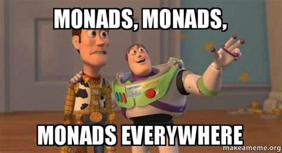

# Semi-Eulerian Fluid Simulation

This program is my attempt at a fluid simulation based on the works of Matthias Müller, as explained in [this video](https://www.youtube.com/watch?v=iKAVRgIrUOU) and [this PDF](https://matthias-research.github.io/pages/tenMinutePhysics/17-fluidSim.pdf). It visualises a circle in a wind tunnel where the wind flows from left to right. Shapes other than a circle can be defined, but tend not to work as well due to the grid based simulation. Such a fluid simulation is rather imperative by nature so implementing it in a functional language was a challenge. 

## Usage

To run, `cabal run -O2` is recommended as the program is quite CPU intensive.

The circle can be moved by dragging the mouse.

There are several variables at the top of the file `Main.hs` which control the parameters of the simulation.

| Variable                   | Description                             |
|----------------------------|-----------------------------------------|
|`width` and `height`        | Control window size                     |
|`cellWidth` and `cellHeight`| Control the resolution of the simulation|
|`cellSpacing`               | The physical size of a single cell (m)  |
|`numIters`                  | Number of divergence iterations. Higher is more accurate, but takes longer.|
|`drawingMode`               | How to visualise the simulation         |
|`dt`                        | The time step used in the simulation    |
|`fluidDensity`              | Density of the fluid                    |

### Visualisation modes

There are four ways of visualising the simulation:
- Smoke : inject some smoke at the left hand side and draw the smoke density at each point.
- Pressure : Visualise the pressure at each point.
- Velocity : Slightly unorthadox method of visualising the horizontal and vertical velocities at each point.
- SmokePressure : View the pressure field multiplied by the smoke field - that has the effect of showing a kind of coloured smoke based on the pressure.

## Examples

